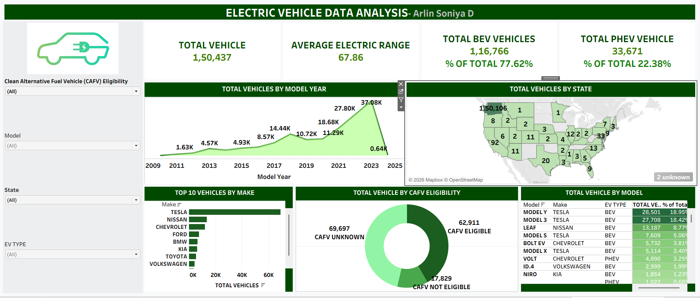

# Electric Vehicle Data Analysis

## 📊 Project Overview

This project analyzes electric vehicle registration data to identify trends in EV adoption, vehicle types, manufacturers, models, electric range, and geographical distribution.

An interactive dashboard was developed using Tableau to transform the data into meaningful insights and visualizations.

## 🛠️ Tools & Technologies

- Tableau
- Data Analysis
- Data Visualization
- Calculated Fields
- Interactive Dashboard

## 📌 Dataset

The dataset contains **150,437 electric vehicle records** and includes information such as:

- Vehicle make and model
- Model year
- Electric vehicle type
- Electric range
- State
- CAFV eligibility

## 📈 Key Metrics

| Metric | Value |
|---|---:|
| Total Vehicles | 150,437 |
| Average Electric Range | 67.86 miles |
| Total BEV Vehicles | 116,766 |
| Total PHEV Vehicles | 33,671 |
| BEV Share | 77.62% |
| PHEV Share | 22.38% |

## 🔍 Analysis Performed

The Tableau dashboard provides analysis of:

- EV registrations by model year
- State-wise EV distribution
- Top 10 vehicle manufacturers
- Vehicle models and registration counts
- BEV vs PHEV distribution
- CAFV eligibility
- Average electric range

## 💡 Key Insights

- Electric vehicle registrations increased significantly over the years.
- **Battery Electric Vehicles (BEVs)** account for approximately **77.62%** of the vehicles analyzed.
- **Plug-in Hybrid Electric Vehicles (PHEVs)** account for approximately **22.38%**.
- **Tesla** is the leading manufacturer by vehicle registrations in the dataset.
- **Tesla Model Y and Model 3** are among the most registered vehicle models.
- EV registrations vary considerably across different states.

## 📊 Live Tableau Dashboard

👉 **[View Live Dashboard](https://public.tableau.com/app/profile/arlin.soniya.d/viz/ELECTRICVEHICLEDATAANALYSIS_17725265422520/ELECTRICVEHICLEDATAANALYSIS)**

## 🖼️ Dashboard Preview

## 📁 Project Files

- `Electric Vehicle Data Analysis.twbx` – Tableau workbook containing the analysis and interactive dashboard.
- `dashboard.png` – Dashboard preview image.

## 🎯 Project Objective

The objective of this project is to analyze electric vehicle registration data and transform raw data into meaningful insights using Tableau and interactive data visualization.
